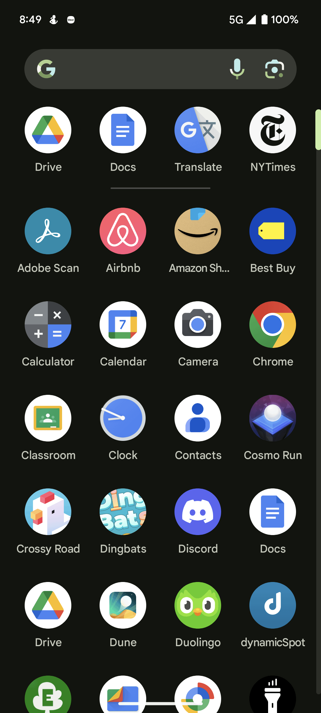
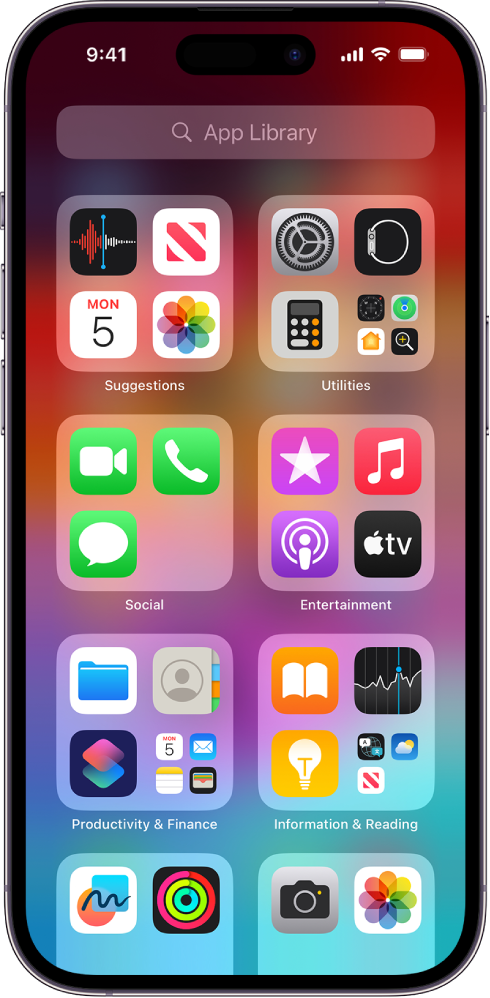
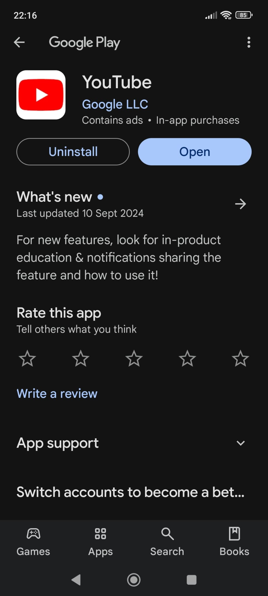
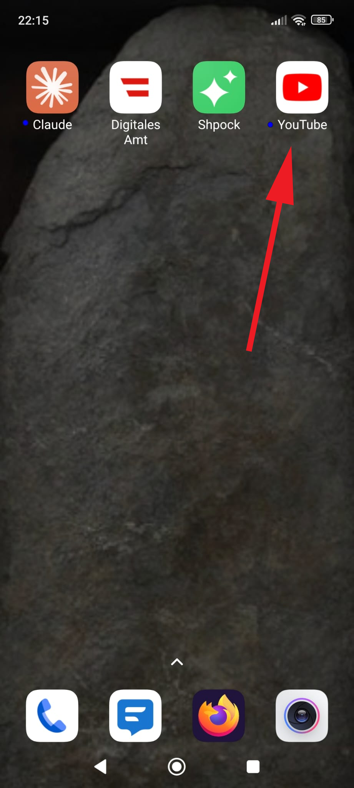

# Getting started

## How to install

This page gives you step-by-step instructions for how to install the official YouTube app on your Apple or Android smartphone.

!!! note

    The information on this page is accurate for phones that are up-to-date as of September, 2024. Depending on your phone and software version, the specific steps might differ to what is shown here.

!!! note "Read this before you start"

    Some phones have the YouTube app installed by default. 
    Here's how to check if your phone already has the YouTube app installed:

    === "Android"
  
        1. Swipe up from the bottom of the display. The "App Drawer" screen will appear (see the screenshot below). Note that what you see might vary slightly depending on your specific model of phone.
        2. Tap the search field, which in the screenshot is shown at the top of the screen.
        3. Type **YouTube**.
        4. If the YouTube app appears in the search results, the app is already installed and you can click on the icon to start using it.

           

    === "Apple"
  
        5. To get to the home screen, either press the physical "Home" button (if your phone has one) or swipe up from the bottom of the screen. 
        6. Then, swipe left all the way until you reach the "App Library" (see the screenshot below).    
        7. Tap the search field, which in the screenshot is at the top of the screen.
        8. Type **YouTube**.
        9. If the YouTube app appears in the search results, the app is already installed and you can click on the icon to start using it.

          
          
=== "Android"
    
    1. Open this page on your phone.
    2. Click [this link](https://play.google.com/store/apps/details?id=com.google.android.youtube&pcampaignid=web_share) to open the Google Play page where you can download the YouTube app. (See the first screenshot below.) (Note that a **Open in another app** popup may appear. If it does, tap **Open** to open the link in the Google Play store.)
    3. Tap **Install** to install the app. The YouTube app is free to download and use. 
    4. The installation proceeds automatically. Depending on your phone, additional security scans or checks may be performed automatically. 
    5. When the installation is completed successfully, the app icon will be appear on the last Home screen (i.e., the one furthest to the right). Tap the **Home** button and swipe to the left until you reach the last screen. (See the second screenshot below.)
    6. The YouTube app is now installed. You can now open the app and log in to your account, see [Login](./intro.md#login-to-youtube).
 
      

      

=== "Apple"
    
    1. Open this page on your phone. 
    2. Click [this link](https://apps.apple.com/at/app/youtube/id544007664) to open the page in the official Apple app store where you can download the YouTube app. (See the first screenshot below.)
    3. Tap the blue "cloud download" icon to install the app. The YouTube app is free to download. 
    4. The download proceeds automatically. Progress is indicated with a blue circular indicator.
    5. When the app is downloaded successfully, the "cloud download" icon becomes an **Open** button. 
    6. The app is now installed successfully. Tap the **Home** button and swipe to the left until you see the YouTube icon, then tap the icon. (The YouTube app icon is shown in the second screenshot, below.)
    7.  You can now open the app and log in to your account, see [Login](./intro.md#login-to-youtube).
 

      
   
       

## Login to YouTube

## Set up your account