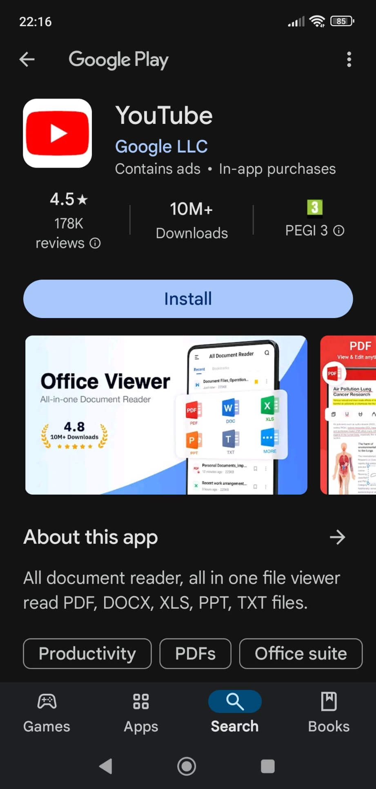
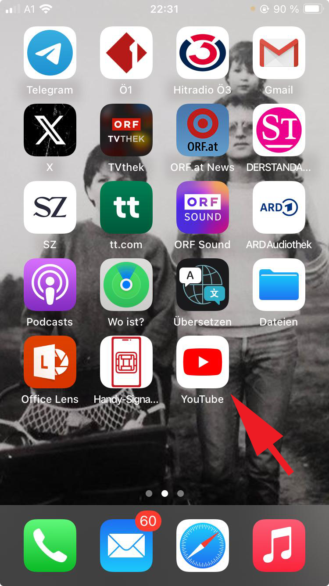

# Getting started

## How to install the YouTube app

This page gives you step-by-step instructions for how to install the official YouTube app on your Apple or Android smartphone.

The YouTube app is free to download and use. You only need to have your phone and access to the internet. 

Before you do anything else, read through all of these steps in order. It might help to have this page open on another device as a reference. 

!!! note

    The information on this page is accurate for most Android and Apple phones that are up-to-date as of September, 2024. 
    Note that what you see might vary slightly from the instructions on this page, depending on your specific model of phone. 

??? note "Is the YouTube app already installed?"

    Some phones have the YouTube app installed by default. 
    Here's how to check if your phone already has the YouTube app installed:

    === "Android"
  
        1. Tap the "Home" button, which is the circle in the bottom-middle of the screen. 
        2. Swipe up from the bottom of the display. The "App Drawer" screen appears (see the screenshot below).
        3. Tap the search field.
        4. Type **YouTube**.
        5. If the YouTube app appears in the search results, the app is already installed and you can click on the icon to start using it.

           

    === "Apple"
  
        1. To get to the home screen, either press the physical "Home" button (if your phone has one) or swipe up from the bottom of the screen. 
        2. Then, swipe left all the way until you reach the "App Library" (see the screenshot below).    
        3. Tap the search field. 
        4. Type **YouTube**.
        5. If the YouTube app appears in the search results, the app is already installed and you can click on the icon to start using it.

          

If the YouTube app isn't already installed, follow the steps below:       
=== "Android"
     
    2. Open this page on your phone.
    3. Click [this link](https://play.google.com/store/apps/details?id=com.google.android.youtube&pcampaignid=web_share) to open the Google Play page where you can download the YouTube app. (See the first screenshot below.) 
    4. Tap **Install** to install the app. 
    5. The installation proceeds automatically.
    6. When the installation is completed successfully, the app icon is visible on the last Home screen (i.e., the one furthest to the right). Tap the "Home" button and swipe to the left until you reach the last screen. (See the second screenshot below.)
    7. The YouTube app is now installed. You can now open the app and set up your account, see [Login](./intro.md#login-to-youtube).
 
      

      

=== "Apple"
    
    2. Open this page on your phone. 
    3. Click [this link](https://apps.apple.com/at/app/youtube/id544007664) to open the page in the official Apple app store where you can download the YouTube app. (See the first screenshot below.)
    4. Tap the blue "cloud download" icon to install the app.
    5. The download proceeds automatically. Progress is indicated with a blue circular indicator.
    6. When the app is downloaded successfully, the "cloud download" icon becomes an **Open** button. 
    7. The app is now installed successfully. Tap the "Home" button and swipe to the left until you see the YouTube icon, then tap the icon. (The YouTube app icon is shown in the second screenshot, below.)
    8.  You can now open the app and set up your account, see [Login](./intro.md#login-to-youtube).
 

       
   
       

## Login to YouTube

!!! Note

    This is a placeholder section. 
    [Click here](./intro.md#getting-started) for installation instructions.

## Set up your account

!!! Note

    This is a placeholder section. 
    [Click here](./intro.md#getting-started) for installation instructions.